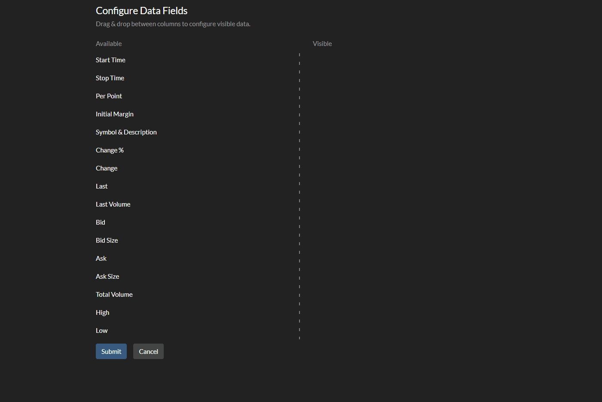

# Column Configurator
This application is a coding exercise using React, [React-Bootstrap](https://react-bootstrap.github.io/), and [react-beautiful-dnd](https://github.com/atlassian/react-beautiful-dnd). Below is pertinent information from the Create React App README, which was used to bootstrap the project.

This project was bootstrapped with [Create React App](https://github.com/facebook/create-react-app).

## Available Scripts

In the project directory, you can run:

### `npm start`

Runs the app in the development mode. 
Open [http://localhost:3000](http://localhost:3000) to view it in the browser.

The page will reload if you make edits. 
You will also see any lint errors in the console.

### `npm run build`

Builds the app for production to the `build` folder. 
It correctly bundles React in production mode and optimizes the build for the best performance.

The build is minified and the filenames include the hashes. 
Your app is ready to be deployed!

See the section about [deployment](https://facebook.github.io/create-react-app/docs/deployment) for more information.

## Debugging with Visual Studio Code

The .vscode folder has been included for demonstration purposes. After dependencies have been installed and the application has been started with `npm start`, the included debug configuration named 'Chrome' can be run from the Visual Studio Debug tools. A browser will attach to the locally running application to debug in Visual Studio Code. 